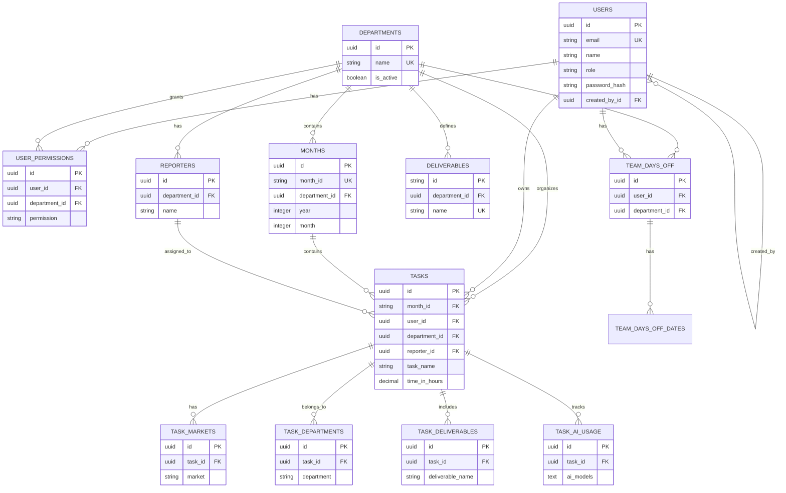

# Task Tracker Database - Relationship Flow Diagram

## Overview
This document illustrates the complete database structure, table relationships, data storage hierarchy, and access control flow.

## Data Storage Hierarchy

```
department/design/year/month/taskdata/idtask
```

**Structure Flow:**
1. **Department** (base reference) → `departments` table
2. **Year/Month** → `months` table (department/year/month)
3. **Task Data** → `tasks` table (department/year/month/taskdata)
4. **Task Details** → Junction tables (markets, departments, deliverables, AI usage)

---

## Tier-Based Architecture

### TIER 1: Core Foundation Tables
**Base tables with no dependencies**

```
┌─────────────────────────────────────┐
│            USERS                    │
│  (Base user accounts)               │
│  - id (UUID)                        │
│  - email, name, role                │
│  - password_hash                    │
│  - Self-reference: created_by_id    │
└─────────────────────────────────────┘
              │
              │ (self-reference)
              └──────────┐
                        │
                        ▼
              ┌──────────────────┐
              │   USERS (self)   │
              └──────────────────┘

┌─────────────────────────────────────┐
│         DEPARTMENTS                  │
│  (Base reference data)               │
│  - id (UUID)                        │
│  - name (e.g., 'design')            │
│  - is_active                        │
│  - Links to users (created_by)      │
└─────────────────────────────────────┘
```

### TIER 2: User-Related Tables
**Access control and user management**

```
┌─────────────────────────────────────┐
│      USER_PERMISSIONS               │
│  ⭐ CENTRAL ACCESS CONTROL ⭐       │
│  - user_id → users.id               │
│  - department_id → departments.id   │
│  - permission (CRUD access)         │
│                                     │
│  Access Control Logic:              │
│  - Filters months by department_id  │
│  - Filters tasks by user_id + dept  │
└─────────────────────────────────────┘
         │                    │
         │                    │
    ┌────▼────┐          ┌────▼────┐
    │  USERS │          │DEPARTMENTS│
    └────────┘          └──────────┘
```

### TIER 3: Department-Related Tables
**Tables linked directly to departments**

```
┌─────────────────────────────────────┐
│            MONTHS                    │
│  (department/year/month)              │
│  - month_id (YYYY-MM)               │
│  - department_id → departments.id   │
│  - Access via user_permissions      │
└─────────────────────────────────────┘
              │
              │ (1:N)
              ▼

┌─────────────────────────────────────┐
│          REPORTERS                   │
│  (Task assignees)                    │
│  - department_id → departments.id   │
└─────────────────────────────────────┘

┌─────────────────────────────────────┐
│        DELIVERABLES                  │
│  (Task templates)                    │
│  - department_id → departments.id   │
└─────────────────────────────────────┘

┌─────────────────────────────────────┐
│       TEAM_DAYS_OFF                  │
│  (User vacation/time off)            │
│  - user_id → users.id               │
│  - department_id → departments.id   │
└─────────────────────────────────────┘
              │
              │ (1:N)
              ▼
┌─────────────────────────────────────┐
│    TEAM_DAYS_OFF_DATES               │
│  (Specific dates off)                │
│  - team_days_off_id                 │
│  - user_id → users.id               │
└─────────────────────────────────────┘
```

### TIER 4: Main Data Tables
**Core task records (access controlled)**

```
┌─────────────────────────────────────┐
│            TASKS                     │
│  ⭐ MAIN DATA TABLE ⭐               │
│  Structure: dept/year/month/task    │
│                                     │
│  Foreign Keys:                      │
│  - month_id → months.month_id       │
│  - user_id → users.id               │
│    (access via user_permissions)    │
│  - department_id → departments.id   │
│    (must match user_permissions)    │
│  - reporter_id → reporters.id       │
└─────────────────────────────────────┘
              │
              │ (1:N)
              ├──────────────────────────────┐
              │                              │
              ▼                              ▼
┌──────────────────────────┐    ┌──────────────────────────┐
│     TASK_MARKETS         │    │   TASK_DEPARTMENTS       │
│  (Many-to-many)          │    │  (Many-to-many)          │
│  - task_id → tasks.id    │    │  - task_id → tasks.id    │
│  - market (code)         │    │  - department (name)     │
└──────────────────────────┘    └──────────────────────────┘
              │                              │
              │ (1:N)                        │ (1:N)
              ▼                              ▼
┌──────────────────────────┐    ┌──────────────────────────┐
│   TASK_DELIVERABLES      │    │     TASK_AI_USAGE         │
│  (One-to-many)           │    │  (One-to-many)            │
│  - task_id → tasks.id    │    │  - task_id → tasks.id     │
│  - deliverable_name      │    │  - ai_models, ai_time    │
│  - count, variations     │    └──────────────────────────┘
└──────────────────────────┘
```

---

## Complete Relationship Flow Diagram

```
┌─────────────────────────────────────────────────────────────────────────────┐
│                          DATABASE RELATIONSHIP FLOW                          │
└─────────────────────────────────────────────────────────────────────────────┘

TIER 1: FOUNDATION
┌──────────┐                    ┌──────────────┐
│  USERS   │                    │ DEPARTMENTS  │
│          │                    │              │
│ id (PK)  │                    │ id (PK)      │
│ email    │                    │ name         │
│ name     │                    │ is_active    │
│ role     │                    │              │
└────┬─────┘                    └──────┬───────┘
     │                                  │
     │ (self-ref)                       │
     └──────────┐                       │
                │                       │
                ▼                       │
         ┌──────────┐                  │
         │  USERS   │                  │
         │(created_by)                 │
         └──────────┘                  │
                                       │
TIER 2: ACCESS CONTROL                 │
                                       │
         ┌─────────────────────────────┼──────────────┐
         │                             │              │
         ▼                             ▼              │
┌─────────────────────────────────────────────────────┐
│         USER_PERMISSIONS (CENTRAL GATEWAY)          │
│  ⭐ ALL ACCESS TO MONTHS & TASKS GOES THROUGH HERE ⭐│
│                                                      │
│  - user_id → users.id                               │
│  - department_id → departments.id                   │
│  - permission (CRUD access)                         │
│                                                      │
│  Access Control:                                    │
│  ✓ Check user_permissions                           │
│  ✓ Filter months by department_id                   │
│  ✓ Filter tasks by user_id + department_id          │
└─────────────────────────────────────────────────────┘
         │                             │
         │                             │
         │                             │
TIER 3: DEPARTMENT DATA                │
         │                             │
         ▼                             ▼
┌──────────────┐              ┌─────────────────┐
│    MONTHS    │              │   REPORTERS     │
│              │              │                 │
│ month_id (PK)│              │ id (PK)         │
│ department_id│───────────────┤ department_id   │
│ year, month  │              │ name, email     │
└──────┬───────┘              └─────────────────┘
       │
       │ (1:N)
       │
       ▼
┌─────────────────────────────────────────────────────┐
│                    DELIVERABLES                      │
│  - id (PK)                                           │
│  - department_id → departments.id                   │
│  - time_per_unit, variations_time                   │
└─────────────────────────────────────────────────────┘

┌─────────────────────────────────────────────────────┐
│                 TEAM_DAYS_OFF                       │
│  - id (PK)                                           │
│  - user_id → users.id                               │
│  - department_id → departments.id                   │
│  - base_days, days_off, days_remaining             │
└──────┬──────────────────────────────────────────────┘
       │
       │ (1:N)
       ▼
┌─────────────────────────────────────────────────────┐
│            TEAM_DAYS_OFF_DATES                      │
│  - id (PK)                                           │
│  - team_days_off_id → team_days_off.id             │
│  - user_id → users.id                               │
│  - date_string, day, month, year                    │
└─────────────────────────────────────────────────────┘

TIER 4: MAIN DATA (ACCESS CONTROLLED)
       │
       │ (1:N)
       ▼
┌─────────────────────────────────────────────────────┐
│                      TASKS                          │
│  ⭐ CORE DATA TABLE - ACCESS VIA USER_PERMISSIONS ⭐│
│                                                      │
│  Foreign Keys:                                       │
│  - month_id → months.month_id                       │
│  - user_id → users.id (via user_permissions)        │
│  - department_id → departments.id                    │
│    (must match user_permissions.department_id)      │
│  - reporter_id → reporters.id                       │
│                                                      │
│  Task Data:                                          │
│  - task_name, products                              │
│  - time_in_hours                                    │
│  - start_date, end_date                             │
│  - is_vip, reworked, use_shutterstock              │
└──────┬──────────────────────────────────────────────┘
       │
       │ (1:N)
       ├──────────────────────────────────────────────┐
       │                                              │
       ▼                                              ▼
┌──────────────────┐                    ┌──────────────────┐
│  TASK_MARKETS    │                    │TASK_DEPARTMENTS  │
│  (Many-to-many)  │                    │(Many-to-many)    │
│                  │                    │                  │
│ task_id → tasks  │                    │ task_id → tasks  │
│ market (code)    │                    │ department       │
└──────────────────┘                    └──────────────────┘
       │                                              │
       │ (1:N)                                        │ (1:N)
       ▼                                              ▼
┌──────────────────┐                    ┌──────────────────┐
│TASK_DELIVERABLES │                    │  TASK_AI_USAGE   │
│  (One-to-many)   │                    │  (One-to-many)   │
│                  │                    │                  │
│ task_id → tasks  │                    │ task_id → tasks  │
│ deliverable_name │                    │ ai_models[]      │
│ count, variations│                    │ ai_time         │
└──────────────────┘                    └──────────────────┘
```

---

## Access Control Flow

### Permission Check Process

```
┌─────────────────────────────────────────────────────────────┐
│                    ACCESS CONTROL FLOW                       │
└─────────────────────────────────────────────────────────────┘

1. USER AUTHENTICATION
   ┌─────────┐
   │  USER   │ (login with email/password)
   └────┬────┘
        │
        ▼
2. CHECK USER EXISTS
   ┌─────────────────┐
   │ users.id exists?│
   │ users.is_active?│
   └────┬────────────┘
        │ ✓
        ▼
3. CHECK DEPARTMENT
   ┌──────────────────────┐
   │ departments.id       │
   │ departments.is_active│
   └────┬─────────────────┘
        │ ✓
        ▼
4. CHECK PERMISSIONS ⭐
   ┌─────────────────────────────────────┐
   │ user_permissions                     │
   │ WHERE user_id = ?                    │
   │   AND department_id = ?              │
   │   AND permission = 'read' (or CRUD)  │
   └────┬────────────────────────────────┘
        │ ✓ Permission granted
        │
        ├─────────────────────────────────┐
        │                                 │
        ▼                                 ▼
5a. ACCESS MONTHS                5b. ACCESS TASKS
   ┌──────────────┐              ┌──────────────┐
   │ months       │              │ tasks        │
   │ WHERE        │              │ WHERE        │
   │   department_id = ?         │   user_id = ?│
   │   (from permissions)        │   AND        │
   │                             │   department_id = ?│
   │                             │   (from permissions)│
   └──────────────┘              └──────────────┘
```

### Data Access Rules

| Table | Access Control | Filter Criteria |
|-------|---------------|-----------------|
| **months** | Via `user_permissions` | `department_id` must match user's permission |
| **tasks** | Via `user_permissions` | `user_id` AND `department_id` must match permissions |
| **reporters** | Direct (department-based) | `department_id` (no permission check needed) |
| **deliverables** | Direct (department-based) | `department_id` (no permission check needed) |
| **team_days_off** | Direct (user-based) | `user_id` (no permission check needed) |

---

## Relationship Types

### One-to-Many (1:N) Relationships

```
users (1) ────────→ (N) user_permissions
users (1) ────────→ (N) tasks
users (1) ────────→ (N) team_days_off
users (1) ────────→ (N) users (self-reference: created_by)

departments (1) ───→ (N) user_permissions
departments (1) ───→ (N) months
departments (1) ───→ (N) reporters
departments (1) ───→ (N) deliverables
departments (1) ───→ (N) team_days_off
departments (1) ───→ (N) tasks

months (1) ────────→ (N) tasks

reporters (1) ─────→ (N) tasks

tasks (1) ─────────→ (N) task_markets
tasks (1) ─────────→ (N) task_departments
tasks (1) ─────────→ (N) task_deliverables
tasks (1) ─────────→ (N) task_ai_usage

team_days_off (1) ─→ (N) team_days_off_dates
```

### Many-to-Many (M:N) Relationships

```
tasks ↔ markets (via task_markets)
tasks ↔ departments (via task_departments)
users ↔ departments (via user_permissions)
```

---

## Data Storage Pattern

### Hierarchical Structure

```
department/
  └── design/                    (departments table)
      └── 2024/                  (year_id in months)
          └── 01/                (month in months)
              └── month_id: "2024-01"  (months table)
                  └── tasks/           (tasks table)
                      └── task_id: UUID
                          ├── task_markets
                          ├── task_departments
                          ├── task_deliverables
                          └── task_ai_usage
```

### Example Data Flow

```
1. User creates task:
   User → user_permissions (check access) → departments → months → tasks

2. Query tasks for user:
   User → user_permissions (get allowed departments) 
        → tasks (filter by user_id + department_id)
        → months (join for month info)
        → reporters (join for reporter info)

3. Query months for department:
   User → user_permissions (check department access)
        → months (filter by department_id)
```

---

## Key Foreign Key Relationships

### Physical Foreign Keys (Database Constraints)

```sql
-- Tier 1: Foundation
users.created_by_id → users.id (self-reference)

-- Tier 2: Access Control
user_permissions.user_id → users.id
user_permissions.department_id → departments.id

-- Tier 3: Department Data
months.department_id → departments.id
months.created_by_id → users.id
months.updated_by_id → users.id

reporters.department_id → departments.id
reporters.created_by_id → users.id
reporters.updated_by_id → users.id

deliverables.department_id → departments.id
deliverables.created_by_id → users.id
deliverables.updated_by_id → users.id

team_days_off.user_id → users.id
team_days_off.department_id → departments.id
team_days_off.created_by_id → users.id
team_days_off.updated_by_id → users.id

team_days_off_dates.team_days_off_id → team_days_off.id
team_days_off_dates.user_id → users.id

-- Tier 4: Main Data
tasks.month_id → months.month_id
tasks.user_id → users.id
tasks.department_id → departments.id
tasks.reporter_id → reporters.id
tasks.created_by_id → users.id
tasks.updated_by_id → users.id

-- Tier 5: Task Details
task_markets.task_id → tasks.id
task_departments.task_id → tasks.id
task_deliverables.task_id → tasks.id
task_ai_usage.task_id → tasks.id
```

### Logical Relationships (Access Control)

```sql
-- Access Control (via user_permissions - no FK, but used in WHERE clauses)
user_permissions.user_id + department_id → tasks.user_id + tasks.department_id
user_permissions.department_id → months.department_id
```

---

## Query Patterns

### Common Query Flows

#### 1. Get User's Accessible Tasks
```sql
-- Step 1: Get user's permitted departments
SELECT department_id 
FROM user_permissions 
WHERE user_id = ? AND permission = 'read';

-- Step 2: Get tasks for those departments
SELECT t.* 
FROM tasks t
WHERE t.user_id = ?
  AND t.department_id IN (SELECT department_id FROM user_permissions WHERE user_id = ?);
```

#### 2. Get Months for Department
```sql
-- Step 1: Check permission
SELECT * FROM user_permissions 
WHERE user_id = ? AND department_id = ?;

-- Step 2: Get months (if permission exists)
SELECT * FROM months 
WHERE department_id = ?;
```

#### 3. Get Task with All Related Data
```sql
SELECT 
  t.*,
  m.month_name, m.year,
  u.name as user_name,
  r.name as reporter_name,
  d.name as department_name,
  -- Junction tables
  (SELECT array_agg(market) FROM task_markets WHERE task_id = t.id) as markets,
  (SELECT array_agg(department) FROM task_departments WHERE task_id = t.id) as departments,
  (SELECT json_agg(row_to_json(td)) FROM task_deliverables td WHERE td.task_id = t.id) as deliverables,
  (SELECT json_agg(row_to_json(ai)) FROM task_ai_usage ai WHERE ai.task_id = t.id) as ai_usage
FROM tasks t
JOIN months m ON t.month_id = m.month_id
JOIN users u ON t.user_id = u.id
LEFT JOIN reporters r ON t.reporter_id = r.id
JOIN departments d ON t.department_id = d.id
WHERE t.id = ?
  AND EXISTS (
    SELECT 1 FROM user_permissions up
    WHERE up.user_id = ?
      AND up.department_id = t.department_id
  );
```

---

## Summary

### Table Count
- **Total Tables:** 13
- **Core Tables:** 6 (users, departments, user_permissions, months, reporters, deliverables, team_days_off, tasks)
- **Junction Tables:** 5 (task_markets, task_departments, task_deliverables, task_ai_usage, team_days_off_dates)

### Key Concepts

1. **Access Control:** `user_permissions` is the central gateway - all access to `months` and `tasks` is controlled through it
2. **Department-Centric:** Most tables link to `departments` - the base organizational unit
3. **Hierarchical Structure:** `department/year/month/taskdata/idtask`
4. **No Direct User-Task FK:** User access to tasks is controlled via `user_permissions`, not a direct foreign key
5. **Self-Referencing:** `users` table has self-reference for `created_by_id`

### Data Integrity Rules

- **Cascade Deletes:** 
  - `user_permissions` → CASCADE on user/department delete
  - `tasks` → CASCADE on month delete
  - Task junction tables → CASCADE on task delete
  
- **Restrict Deletes:**
  - `months` → RESTRICT on department delete (protect data)
  
- **Set Null:**
  - Most `created_by_id`/`updated_by_id` → SET NULL on user delete
  - `tasks.reporter_id` → SET NULL on reporter delete

---

## Mermaid Diagram (Alternative Visualization)



---

*Last Updated: Based on `mydata_sqlflow.sql` and `server/db/init.sql`*

